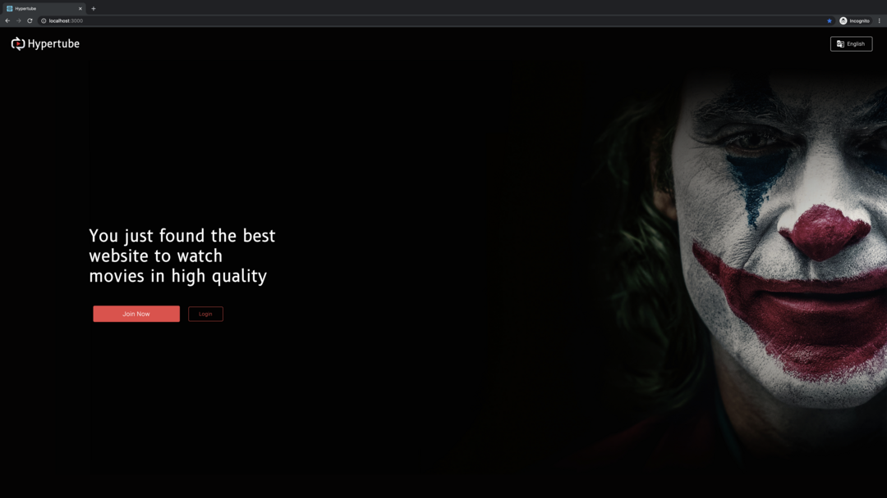
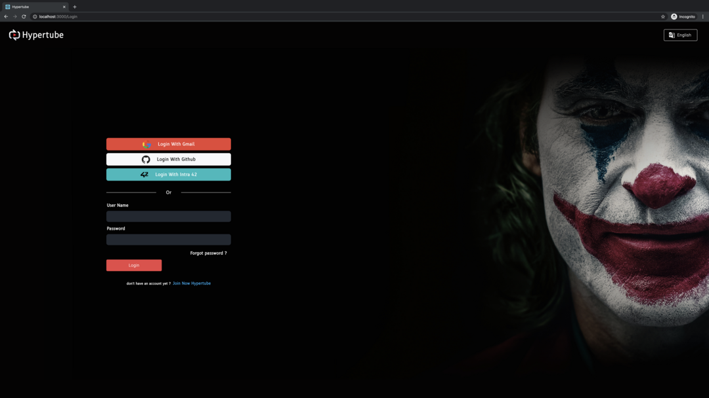
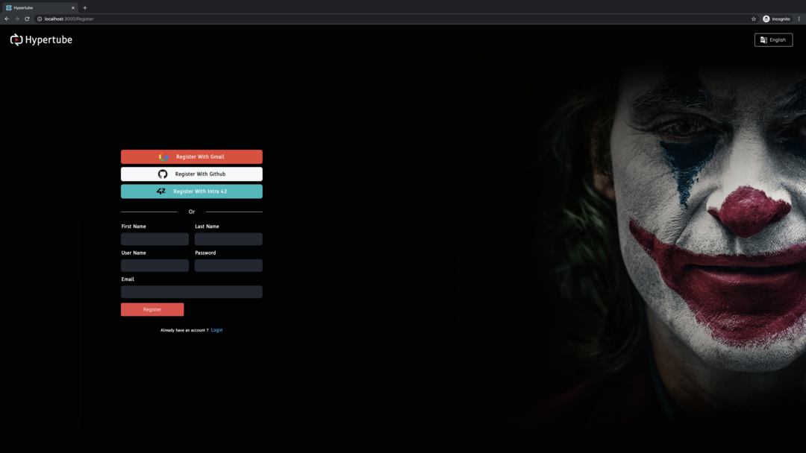
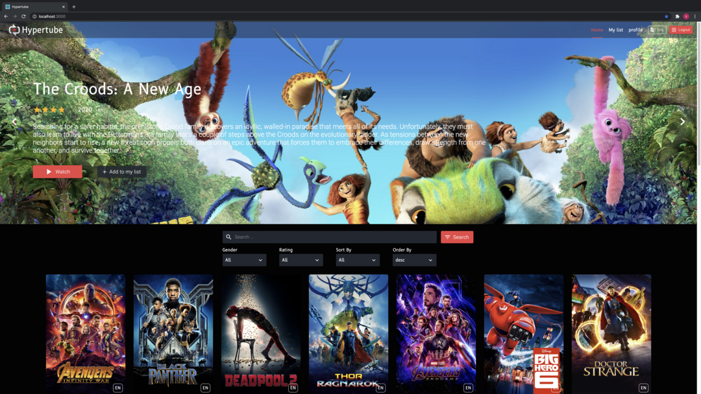
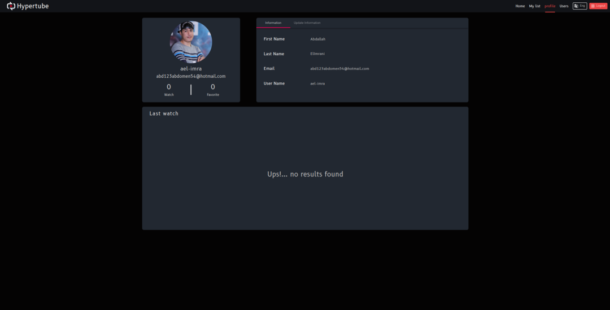
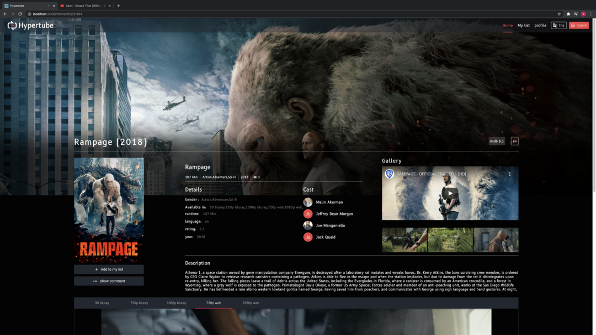
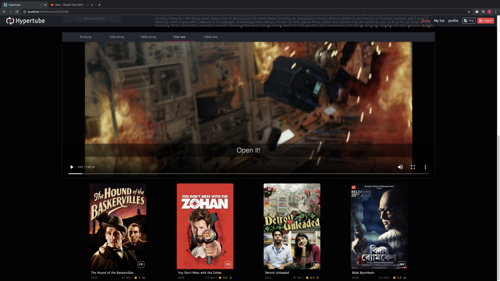
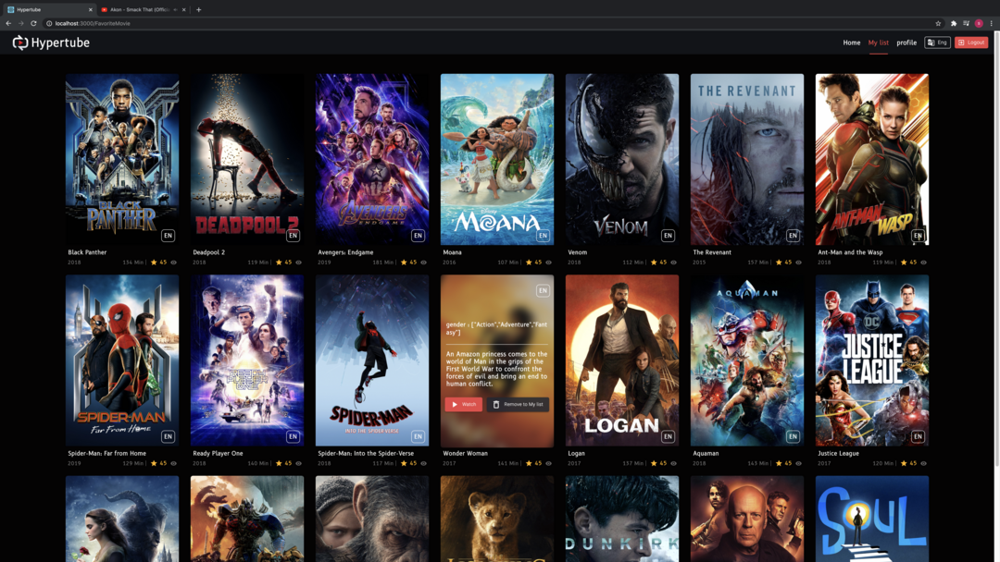
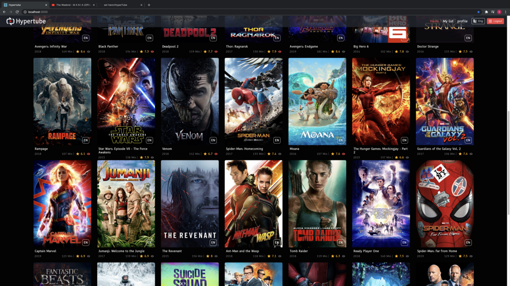

# HyperTube

This project is a web application that allows a user to search and watch movies. The player will be directly integrated into the site, and the movies will be downloaded via the BitTorrent protocol.

### Stack

- Node JS (Express)
- React JS
- Material UI Front libraries
- MySQL
- JSON web tokens
- Axios for API requests

## Installation

Use the package manager [npm](https://pip.pypa.io/en/stable/) to install client and server.

```bash
npm install
```

## How to launch

```bash
//run development mode
npm run dev
//run production mode
npm start
```

## Screenshots

<div align="center">
    
    
    
    
    
    
    
    
    
</div>

## License

[MIT](https://choosealicense.com/licenses/mit/)
